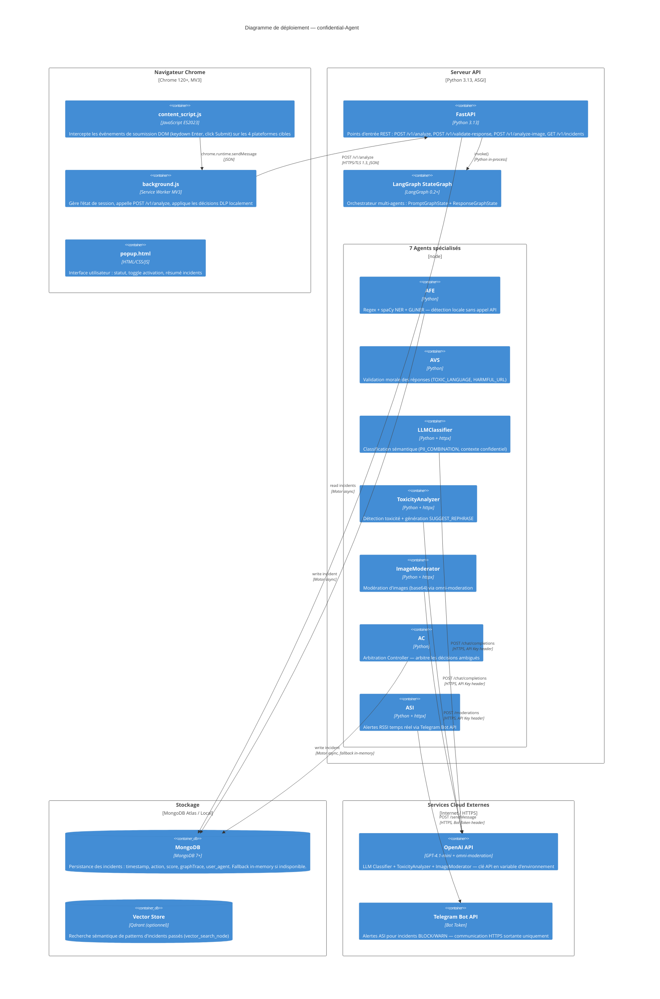

# Architecture — confidential-Agent

> **Version** V2 (LangGraph multi-agent pipeline)  
> **Mis à jour** : 2026-06-25  
> Répond à la lacune MAJEUR identifiée dans le rapport d'analyse : "Absence de diagramme de déploiement (infrastructure view)"

---

## 1. Vue d'ensemble — C4 Level 1 (Contexte système)

```
  ┌─────────────────────────────────────────────────────────────┐
  │                   UTILISATEUR FINAL                          │
  │            (employé, consultant, étudiant)                   │
  └──────────────────────────┬──────────────────────────────────┘
                             │ tape un prompt / reçoit une réponse
                             ▼
  ┌─────────────────────────────────────────────────────────────┐
  │              CONFIDENTIAL-AGENT (ce système)                 │
  │                                                             │
  │   Extension Chrome MV3  ──►  FastAPI + LangGraph  ──►  DB  │
  └──────────────┬──────────────────────────┬───────────────────┘
                 │                          │
                 ▼                          ▼
  ┌──────────────────────┐    ┌─────────────────────────────────┐
  │  Plateformes IA cibles│    │  Services cloud externes         │
  │  ChatGPT · Claude.ai │    │  OpenAI API · Telegram Bot API  │
  │  Gemini · Facebook   │    └─────────────────────────────────┘
  └──────────────────────┘
```

---

## 2. Diagramme de déploiement — C4 Level 3 (Infrastructure)



---

## 3. Frontières de sécurité (Trust Boundaries)

```
╔═══════════════════════════════════════════════════════════════════╗
║  FRONTIÈRE 1 : Appareil de l'utilisateur (trust boundary haute)   ║
║                                                                   ║
║  Chrome Extension MV3 — sandbox isolé du DOM de la page          ║
║  ├─ content_script.js : lecture seule du DOM, event interception  ║
║  ├─ background.js     : service worker, accès network limité      ║
║  └─ Permissions MV3   : host_permissions déclaratifs, CSP strict  ║
║                                                                   ║
║  Données sensibles en transit : HTTPS/TLS 1.3 obligatoire         ║
║  Authentification : JWT (HS256, expiration 24h) dans Authorization║
╚═══════════════════════════════════════════════════════════════════╝
          │ HTTPS/TLS 1.3 + JWT Bearer
          ▼
╔═══════════════════════════════════════════════════════════════════╗
║  FRONTIÈRE 2 : Serveur API maîtrisé (trust boundary maîtrisée)    ║
║                                                                   ║
║  FastAPI (ASGI, Python 3.13)                                      ║
║  ├─ CORS : origines whitelistées uniquement                       ║
║  ├─ Rate limiting : 60 req/min /analyze, 20 req/min /analyze-image║
║  ├─ Validation Pydantic : rejet strict des payloads malformés     ║
║  └─ JWT decode + vérification expiration à chaque requête         ║
║                                                                   ║
║  LangGraph agents : cloisonnement strict des entrées              ║
║  ├─ LLM classifier reçoit le prompt ANONYMISÉ (jamais le PII brut)║
║  └─ Fragments PII : jamais loggés en clair en production          ║
║                                                                   ║
║  MongoDB : TLS activé, auth par URI connection string             ║
║  ├─ Incidents anonymisés avant stockage                           ║
║  └─ Fallback in-memory si MongoDB indisponible (fail-open garanti)║
╚═══════════════════════════════════════════════════════════════════╝
          │ HTTPS + API Key / Bot Token
          ▼
╔═══════════════════════════════════════════════════════════════════╗
║  FRONTIÈRE 3 : Services cloud externes (trust boundary non maîtrisée) ║
║                                                                   ║
║  OpenAI API : prompt anonymisé uniquement transmis                ║
║  ├─ LLM Classifier : reçoit le prompt POST-anonymisation          ║
║  ├─ ToxicityAnalyzer : reçoit le texte brut (max 1 500 chars)    ║
║  └─ API key stockée en variable d'environnement (.env, jamais git)║
║                                                                   ║
║  Telegram Bot API : métadonnées d'alerte uniquement               ║
║  └─ PII fragmentaire anonymisé avant transmission                 ║
║                                                                   ║
║  VECTEUR RÉSIDUEL (hors périmètre by design) :                    ║
║  Brèches côté infrastructure LLM (Redis/OpenAI 2023,             ║
║  indexation Google 2025) — non addressable côté client.           ║
║  Solution prospective : FHE (chiffrement homomorphe) ou LLM local.║
╚═══════════════════════════════════════════════════════════════════╝
```

---

## 4. Flux de données sensibles

### 4.1 Pipeline prompt (UTILISATEUR → IA)

```
Utilisateur saisit prompt
        │
        ▼
content_script.js intercepte l'événement Submit
        │
        ├─► [prompt brut] ──► background.js
        │                          │
        │                          ▼
        │                   POST /v1/analyze (HTTPS/TLS 1.3)
        │                   Body: { prompt, user_consent, user_id }
        │                          │
        │                          ▼
        │                   LangGraph PromptGraphState
        │                   ┌──────────────────────────┐
        │                   │  AFE (regex + spaCy)      │──► détections PII
        │                   │  ↓ anonymized_prompt      │
        │                   │  VectorSearch (sémantique) │
        │                   │  ↓                        │
        │                   │  LLMClassifier (si besoin) │──► OpenAI API (anonymisé)
        │                   │  ↓                        │
        │                   │  AC (arbitration)          │
        │                   │  ↓                        │
        │                   │  ToxicityAnalyzer          │──► OpenAI API
        │                   └──────────────────────────┘
        │                          │
        │                   PolicyDecision { action, score, graphTrace }
        │                          │
        │                   ┌──────┴───────┐
        │                ALLOW          ANONYMIZE/WARN/BLOCK/SUGGEST_REPHRASE
        │                   │                    │
        │                   ▼                    ▼
        │             prompt envoyé        prompt bloqué / anonymisé
        │             à la plateforme      ou suggestions affichées
        │
        └─► ASI ──► Telegram Bot (si BLOCK ou WARN)
```

### 4.2 Pipeline réponse (IA → UTILISATEUR)

```
Réponse IA reçue dans le DOM
        │
content_script.js intercepte avant affichage
        │
background.js ──► POST /v1/validate-response
        │
LangGraph ResponseGraphState
  AVS (toxic + harmful URL) → LLMClassifier (moral) → AC → ToxicityAnalyzer
        │
PolicyDecision { action, score, graphTrace }
        │
  ALLOW ──► affichage normal
  WARN  ──► affichage avec bannière avertissement
  BLOCK ──► réponse masquée + alerte
```

---

## 5. Évolution V1 → V2 → V3

| Version | Fonctionnalités ajoutées |
|---------|--------------------------|
| V1      | Regex baseline, MongoDB stub, pas d'agents |
| V2 (actuel) | LangGraph StateGraph, 7 agents, SUGGEST_REPHRASE, SWIFT_BIC, IBAN, spaCy NER, GLiNER, vector search, image moderation, JWT auth, rate limiting |
| V3 (prospectif) | AMUA (Analyse Multi-Utilisateurs Agrégée), RBAC multi-tenant, Firefox extension, IDE extension (VS Code), LLM local (Ollama) pour réduire dépendance OpenAI |
