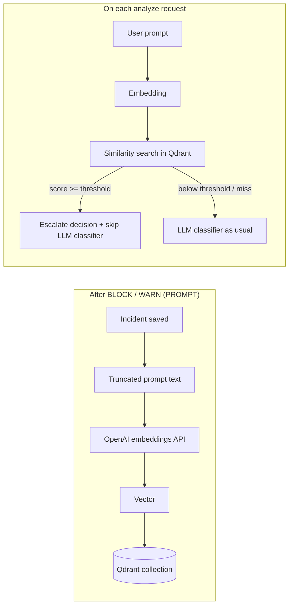

# Qdrant & semantic vector search (Notion Ready)

This page describes the optional **Qdrant** integration: embeddings, incident indexing, and shortcutting the LLM classifier when a new prompt is semantically close to a past **BLOCK** or **WARN** incident.

You can paste this document into Notion as a technical reference page (Markdown import or copy-paste). Mermaid diagrams render in Notion when using a Mermaid block or supported import.

---

## 1) Purpose

- **Reduce** expensive `chat/completions` calls to the LLM classifier when a similar risky prompt was already seen.
- **Store** dense vectors in **Qdrant** (not in MongoDB). MongoDB still holds incidents with redacted previews only.
- **Stay safe**: if Qdrant or the embedding API fails, the API **fails open** and runs the normal pipeline (LLM classifier unchanged).

---

## 2) High-level flow



---

## 3) LangGraph prompt pipeline (when enabled)

Order of nodes:

1. `afe`
2. `vector_search` (only if `VECTOR_SEARCH_ENABLED=true`)
3. `llm_classifier` **skipped** when vector search finds a strong match and sets `skip_llm_classifier`
4. `ac`
5. `toxicity_analyzer` (conditional, same rules as before)

Example trace **without** vector shortcut:

`["afe", "vector_search", "llm_classifier", "ac", …]`

Example trace **with** shortcut (no LLM classifier node):

`["afe", "vector_search", "ac", …]`

The response pipeline (`/v1/validate-response`) is **unchanged** — no `vector_search` on AVS today.

---

## 4) Environment variables (summary)

| Variable | Typical value | Notes |
|----------|----------------|--------|
| `VECTOR_SEARCH_ENABLED` | `true` / `false` | Master switch (default off in many setups). |
| `QDRANT_URL` | `http://localhost:6333` or `https://…cloud.qdrant.io` | HTTP(S) REST endpoint. |
| `QDRANT_API_KEY` | *(secret)* | **Required** for Qdrant Cloud; omit for local Docker. |
| `QDRANT_COLLECTION` | `confidential_agent_incidents` | Collection name; created on first use if missing. |
| `EMBEDDING_MODEL` | `text-embedding-3-small` | Same API key/base as LLM (`OPENAI_API_KEY` / `LLM_CLASSIFIER_*`). |
| `EMBEDDING_DIMENSIONS` | `1536` | Must match model output. |
| `VECTOR_MATCH_MIN_SCORE` | `0.88` | Minimum cosine similarity to trust a match. |
| `VECTOR_SOURCE_MAX_CHARS` | `4000` | Max characters sent from the prompt into indexing and embedding. |
| `QDRANT_PREFER_GRPC` | `false` | Set `true` only if you use gRPC with `QDRANT_GRPC_PORT`. |

Full list and comments: `services/security-api/.env.example`.

---

## 5) Local Docker vs Qdrant Cloud

**Local (development)**

```bash
cd infra/docker
docker compose up qdrant -d
```

- Dashboard: `http://localhost:6333/dashboard`
- Sanity check: `curl -s http://localhost:6333/collections`

**Cloud**

- Create a cluster in the Qdrant Cloud dashboard.
- Copy the **HTTPS** cluster URL and an **API key** into `QDRANT_URL` and `QDRANT_API_KEY`.
- A single-node free tier is usually enough for moderate incident volume.

---

## 6) What gets indexed

- Only **PROMPT** incidents with final action **BLOCK** or **WARN**.
- The API passes a truncated copy of the prompt as `vectorSourceText` for embedding; it is **stripped before MongoDB** and used only for Qdrant upsert.

---

## 7) Testing

- Vector / embedding unit tests: `tests/test_vector_search.py`
- Orchestrator (including skip-LLM path): `tests/test_langgraph_orchestrator.py`

```bash
cd services/security-api
uv run pytest tests/test_vector_search.py tests/test_langgraph_orchestrator.py -q
```

---

## 8) Related code

| Area | Path |
|------|------|
| Orchestration | `services/security-api/app/agents/orchestrator.py` |
| Vector node | `services/security-api/app/agents/vector_search_node.py` |
| Qdrant client & upsert/search | `services/security-api/app/stores/vector_store.py` |
| Embeddings | `services/security-api/app/services/embedding_service.py` |
| Incident hook (index after save) | `services/security-api/app/core/incident_store.py` |
| Ephemeral `vectorSourceText` on analyze | `services/security-api/app/api/routes_analyze.py` |
| Settings | `services/security-api/app/core/config.py` |

---

## 9) Operational notes

- **Client/server version**: align `qdrant-client` with the Qdrant server major version when possible to avoid compatibility warnings.
- **Privacy**: vectors are derived from prompt text sent to the embedding provider; tune retention and access to Qdrant according to your policy.

---

## See also

- Main workflow (LangGraph overview): `docs/NOTION_WORKFLOW_GUIDE.md`
- API env vars: `services/security-api/README.md`
- Root quick start: `README.md` (section Docker / Qdrant)
