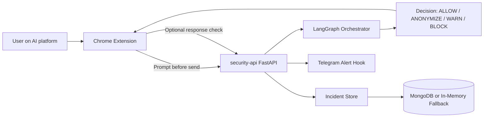
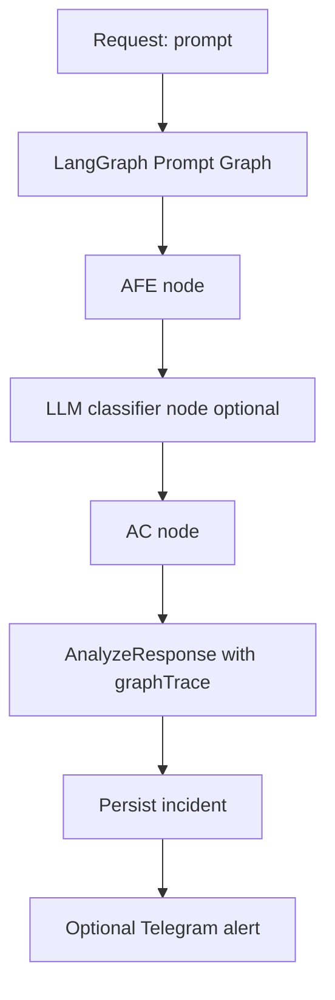
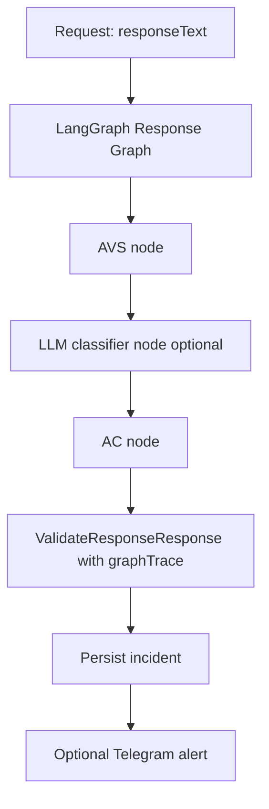

# Confidential-Agent Workflow Guide (Notion Ready)

This document explains how the current multi-agent backend works, where LangGraph is used, and how to test each workflow.
You can paste it directly into Notion as a technical reference page.

## 1) Product workflow at a glance



## 2) LangGraph usage in this system

LangGraph is used in `services/security-api/app/agents/orchestrator.py`.

Two state graphs are compiled:

1. Prompt graph
   - `afe` node: input filtering analysis
   - `llm_classifier` node: optional OpenAI-compatible sensitive-text classifier (fail-open)
   - `ac` node: arbitration
   - trace example: `["afe", "llm_classifier", "ac"]`

2. Response graph
   - `avs` node: AI response validation
   - `llm_classifier` node: same optional classifier on response text
   - `ac` node: arbitration
   - trace example: `["avs", "llm_classifier", "ac"]`

The API returns this execution order as `graphTrace` so each decision is auditable.

## 3) Endpoint workflows

### A) Prompt analysis workflow

Endpoint: `POST /v1/analyze`



### B) Response validation workflow

Endpoint: `POST /v1/validate-response`



### C) Incident retrieval workflow

Endpoint: `GET /v1/incidents`

- reads incidents from MongoDB if reachable
- otherwise uses in-memory fallback
- returns incident list and `total`

## 4) Agent responsibilities

- `AFE` (Input Filtering Agent): prompt-level risk decision
- `AVS` (AI Validation Sentinel): response-level risk decision
- `llm_classifier`: optional second opinion via chat-completions API (see `LLM_CLASSIFIER_*` env vars in `services/security-api/README.md`)
- `AC` (Arbitration Controller): confirms/adjusts ambiguous decisions
- `ASI` (Alerting and Surveillance Intelligence): sends critical notifications (Telegram hook)

## 5) Runtime observability

The following fields are now available for tracing:

- API responses: `graphTrace`
- stored incidents: `graphTrace`, `incidentType`, `contentPreview`

This provides a minimal but concrete explanation of what the LangGraph pipeline executed.

## 6) How to test at this stage

From `services/security-api`:

```bash
uv run pytest -q
```

Run only orchestrator tests:

```bash
uv run pytest -q tests/test_langgraph_orchestrator.py
```

Run only API incident tests:

```bash
uv run pytest -q tests/test_api_incidents.py
```

Run only LLM classifier unit tests:

```bash
uv run pytest -q tests/test_llm_classifier.py
```

Manual API checks (after starting server):

- `GET /health`
- `POST /v1/analyze`
- `POST /v1/validate-response`
- `GET /v1/incidents`

Expected:

- analyze response includes `graphTrace: ["afe", "llm_classifier", "ac"]`
- validate-response includes `graphTrace: ["avs", "llm_classifier", "ac"]`
- incidents include `incidentType` and `graphTrace`

## 7) Current limits and next increment

`AFE` / `AVS` still use deterministic policy logic; the optional `llm_classifier` adds model-assisted escalation in fail-open mode.

Next increment ideas:

- richer policies per tenant
- stronger UX in the extension for WARN/BLOCK on responses

While preserving:

- test coverage
- graph traceability
- fail-open resilience for persistence/alerting and for the LLM node
